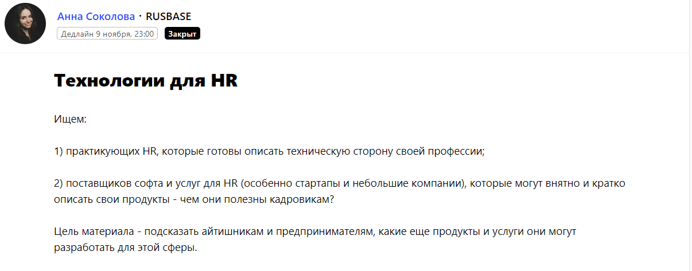
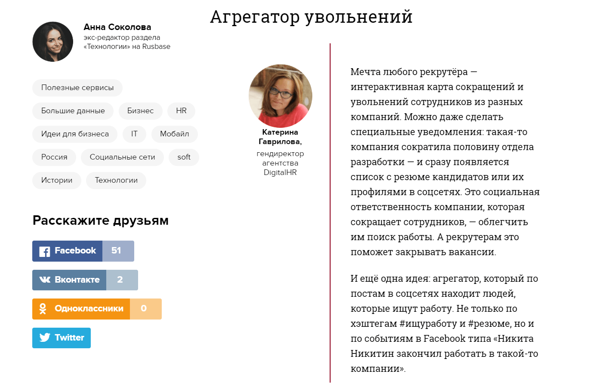
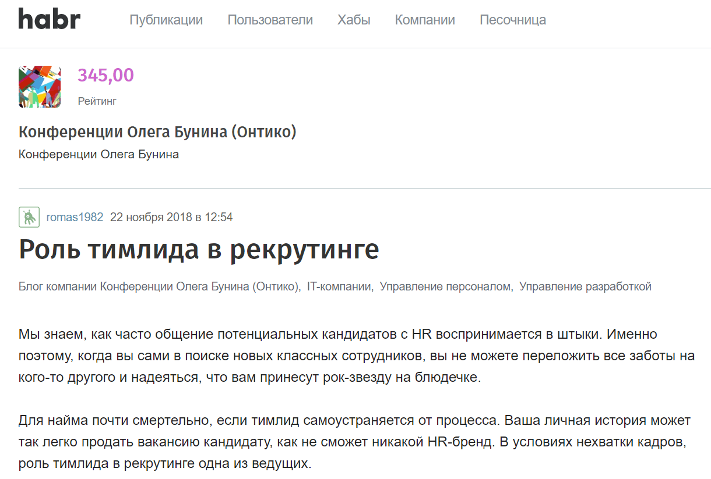
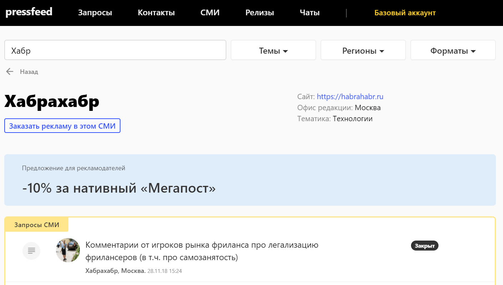
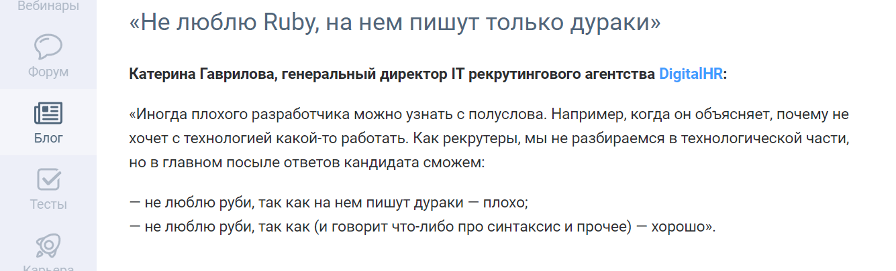

Мы ― рекрутинговое агентство [DigitalHR](https://digitalhr.ru/?lang=ru) ― закрываем ИТ и Digital вакансии с 2011 года. Цель агентства ― освободить руководителей компании от непрофильной работы по поискам сотрудников, чтобы они могли заняться развитием бизнеса. Услуги агентства направлены на 2 целевые группы: компании, которым нужна помощь в поиске сотрудника и кандидаты ― профессионалы, ищущие работу. Мы помогаем им встретиться с их «идеальной» компанией.

## Почему мы начали заниматься контент-маркетингом и работать со СМИ

В агентстве действует реферальная программа, ИТ-компании часто рекомендуют нас друг другу, многие кандидаты также находятся в одной «тусовке» и могут посоветовать знакомым обратиться к нам при поиске работы. «Сарафанное радио» играет большую роль в работе DigitalHR, но этого недостаточно. Необходимо повышать узнаваемость бренда, формировать доверие целевой аудитории, демонстрировать экспертность агентства. Именно поэтому за 2018 год мы приняли участие в десятке профильных конференций и форумах. Однако и этого мало. Отраслевые мероприятия работают только на участников мероприятий, можно сказать, точечно, и охватывают далеко не всю аудиторию, на которую мы стремимся выйти.

> Контент-маркетинг действует по-другому: эффект от публикаций в СМИ виден только в долгосрочной перспективе, выпускать контент нужно регулярно, но зато охваты значительно превышают количество участников конференций. Тем более, контент-маркетинг ― инструмент, который поглотил digital-сферу, сейчас каждая адекватная компания ведет блог, потому что понимает, что это работает.

Поэтому еще несколько лет назад мы поставили в компании цель ― выпускать по 3-4 текста с участием DigitalHR в месяц. Больше пока не получается: не хватает временных ресурсов. А делать меньше нет смысла, ведь чтобы публикации в СМИ работали на бизнес и привлекали новых клиентов, важна регулярность.

## О чем пишем тексты и где публикуем их

  
В СМИ мы рассказываем о рекрутинге в ИТ, о рекрутинге в целом, о корпоративной культуре. Смотрим на процесс с точки зрения компаний, с точки зрения соискателей, с точки зрения агентства. Даем советы, как пройти собеседование, на какие качества кандидата обращают внимания в первую очередь, что можно и нельзя писать в резюме.

Также мы определили для себя пул площадок, с которыми нам интересно сотрудничать. В основе выборки ― тематика медиа.

1. Профильные площадки, посвященные digital и ИТ-тематикам. Это vc.ru, Rusbase.ru, Habr, tproger.ru.
2. Отраслевые HR-сайты. Например, «HR по-русски», блог сайта rjob.ru.
3. Бизнес-издания, лайфстайл-издания. К ним мы обращаемся реже, хотя тема трудоустройства и поиска сотрудников интересует всех владельцев компаний.

## Как договориться с изданием о публикации: следить за запросами на Pressfeed

Чтобы начать публиковать статьи на внешних площадках, тексты нужно не только писать, но еще и кому-то их отдавать. Иногда это не полноценные тексты, а участие в публикации в формате комментария эксперта.

Мы советуем два способа, как можно подружиться с редакцией нужного издания.

**Во-первых,** обязательно регистрируйтесь на сервисе журналистских запросов [Pressfeed](https://pressfeed.ru/) и ищите нужные издания там. Это сервис, где журналисты озвучивают темы, на которые пишут статью и для которых ищут экспертов. Бывает, ответите на 1-2 запроса ― и начнете сотрудничать с редакцией регулярно уже напрямую. За время работы с сервисом мы ответили на 69 запросов, половина наших комментариев была принята. Этот инструмент помогает взаимодействовать со СМИ оперативно, а главное ― регулярно.

**Во-вторых,** старайтесь выйти на редакцию самостоятельно: пишите на почту, предлагайте темы, договаривайтесь. Не факт, что получится сразу найти общий язык: для начала нужно доказать, что ваш текст будет полезен читателям издания.

Приведу примеры из практики нашего агентства, как мы выходили на нужные нам площадки.

**Профильные площадки, посвященные digital и ИТ-тематикам**

С площадкой Rusbase мы начинали сотрудничать через Pressfeed еще в 2015 году, когда сервис только запустился. Один из первых запросов был о технологиях в HR.

[_Запрос_](https://pressfeed.ru/query/13062) _от Rusbase_

Директор DigitalHR поделилась мнением, каких сервисов не хватает HR-специалистам.

[_Публикация_](https://rb.ru/story/HR-tech-future/) _на rb.ru_

Так и происходит знакомство с редакцией: сначала ответите на один запрос, потом на второй, потом обменяетесь с журналистом e-mail (или сразу обменяетесь), затем начнете обсуждать темы, позже выходите на редактора, который принимает гостевые посты. Много откликов среди клиентов получают полезные подборки, к примеру, [«Семь сервисов, которые упростят работу рекрутеров»](https://rb.ru/opinion/uprostit-rabotu-rekrutera/). Советы конкретных сервисов или приложений всегда хорошо заходят.

  
_Статья компании на Rusbase_

На Habr мы вышли напрямую через редакцию. Мы не заводили на площадке собственный блог, но опытным путем выяснили, что площадке интересны выступления на мероприятии или вебинаре. Недавно издание выложило расшифровку записи выступления нашего основателя на TeamLead Conf в Петербурге про [роль тимлида в рекрутинге](https://habr.com/company/oleg-bunin/blog/430664/). Публикация набрала более 7 тысяч просмотров, и мы получили много положительных откликов от разработчиков, что очень радует.

[_Публикация на Habr_](https://habr.com/company/oleg-bunin/blog/430664/)

С другой стороны, можно выйти на Habr и через Pressfeed. Найдите издание во вкладке «СМИ» и мониторьте актуальные запросы от журналистов площадки.

Однажды мы отвечали на запрос от редакции блога GeekBrains.

  

[_Запрос_](https://pressfeed.ru/query/17660) _от GeekBrains_

Директор Digital HR, Екатерина Гаврилова рассказала, как в нашем агентстве определяют, что программист не является профессионалом.

  
[_Комментарий_](https://geekbrains.ru/posts/bad_programmers) _в GeekBrains_

  
**Профильные площадки, посвященные HR-тематике**

Отраслевые HR-площадки обычно небольшие и имеют не более 100 тысяч уникальных посетителей в месяц. Их читает узкая аудитория HR-специалистов. С такими площадками легче договориться, но тема должна быть актуальная и небанальная, ведь банальные темы профи давно не интересны, они и сами все знают.

Чтобы найти большинство изданий по HR, легче всего опять обратиться к Pressfeed, зайти в рубрику [«СМИ»](https://pressfeed.ru/smi-catalog) и выбрать фильтр «Работа».